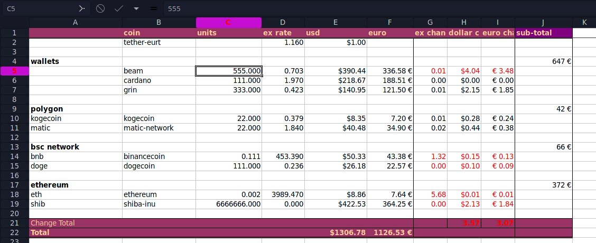
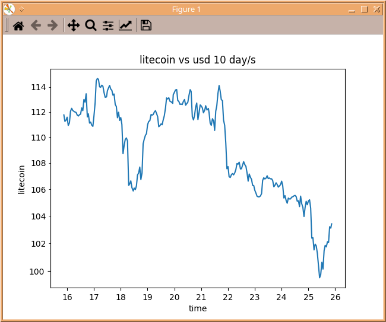

# Simple Crypto Managment Tool
### prerequisits
 - gnumeric
 - python3
 - shell

## pip dependencies
```
pip install beautifulsoup4
pip install pycoingecko
pip install lxml
pip install forex_python
 ```

# User Manual
The `money.xml` file is designed to work with a custom python script that allows you to automatically update the exchange rates using the coingecko api and adds them to the money.xml file based on the coins listed in the coin column.

The value of each crypto asset is automatically calculated to give you an overview of how much money you have and how much you made since the last time you have run the script.

**important**
The coin column should only contain the coingecko api id of the token you want, anything else will not work.

In the units column you should type in how much you have of the coin.

**important**
The ex rate coulmn is automatically updated with the python script. it will only work if there is a value present, so if you make a new row, add a random number value such as 0.

the ex change column should also be filled with 0 if you have made a new row, otherwise it will also update automatically.

for convenience i recommend simply runnig the `./run.sh` script, this will run the python script and then launch the money.xml file with gnumeric

the update_money.py script expects two arguments, the working directory and the xml file name, in run.sh the current directory is used.



## gnumeric columns
column 0
for you to type in any info you like

column 1 (coin)
the coin with the exact api id provided by coingecko

column 2 (units)
the amount you have of the coin

column 3 (ex rate)
add 0 to each row that has a coin compatible with coingecko
is updated automatically with the python script

column 4 (usd)
the units you have * the ex rate

coulmn 5 (euro)
the usd value / the ex rate of euro to usd

column 6 (ex change)
the exchange rate difference between the last time you ran the python script

column 7 (dollar change)
the ex change differece times the units you have

column 8 (euro change)
the usd chage / the ex rate of euro to usd

column 9 (sub-total)
sum up your catagorized crypto asset values


# plot tool
There is also a simple plot python script
```
./plot litecoin usd 10
```


make sure plot is executable and that you have matplotlib installed
```
pip install matplotlib
```
The first parameter is the coingecko coin id, the second is what to compare it with and the third is how many days the plot should display.
The script will automatically fetch the data from coingecko and plot it with matplotlib

